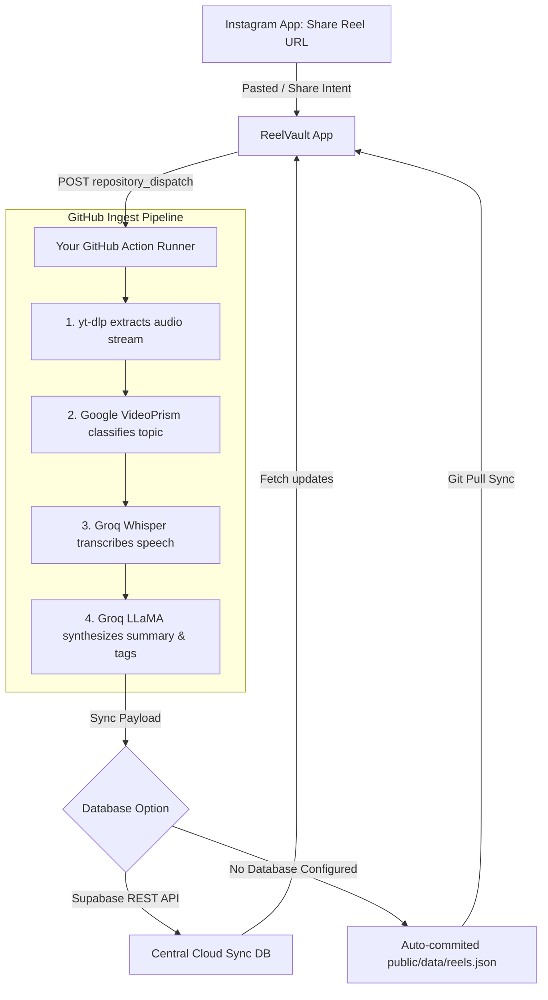

# 🪐 ReelVault

> Declutter, transcribe, and search your Instagram Reels library using an automated, cloud-based AI ingestion pipeline.

```text
    ____                 _    __             _ __
   / __ \___  ___  / /  | |  / /____ ___  __/ / /_
  / /_/ / _ \/ _ \/ /   | | / / __ `/ / / / / __/
 / _, _/  __/  __/ /    | |/ / /_/ / /_/ / / /_
/_/ |_|\___/\___/_/     |___/\__,_/\__,_/_/\__/
```

ReelVault is a highly aesthetic, **local-first** web application (ready for packaging as an Android APK via Capacitor) that organizes your shared Instagram Reels. It offloads heavy video downloads (`yt-dlp`), classifications (`Google VideoPrism`), and speech-to-text summaries (`Groq Whisper + LLaMA-3`) into a private **GitHub Actions workflow**, updating your local IndexedDB library dynamically.

---

## ⚡ Pillars of ReelVault

### 🔮 Premium Cyberpunk Glassmorphism UI
- Deep obsidian canvas (`#08080c`) featuring glowing ambient radial gradients.
- Aesthetic card grids mapping dynamic color gradients based on categorizations (Food, Travel, Tech, Comedy, Music, Lifestyle).
- Live scrollable logs terminal with retro font displays and blinking green diagnostic carets.

### 🐙 Hybrid Pipeline Architecture
- **GitHub Action Mode:** Connects to your GitHub repository using Personal Access Tokens (PATs) and triggers a `repository_dispatch` event when you click share on Instagram.
- **Simulation Mode:** Runs a high-fidelity client-only terminal simulator that models the downloading, transcribing, and summarizing processes step-by-step for instant local verification.

### 💾 Local-First Sandbox Database
- Utilizes Dexie.js (IndexedDB) to save summaries, full transcripts, favorite lists, and timestamps offline.
- Interactive, auto-saving notes notebook inside each reel detail panel to write down cooking recipes, travel coordinates, or custom tags.
- Secure, on-device local storage for connection credentials with full backup JSON export and import capabilities.

---

## 🛠 Tech Stack

- **Core:** React 19, Vite, Javascript
- **Styling:** Vanilla CSS, Tailwind CSS v4, Lucide Icons, Canvas-Confetti
- **Local DB:** Dexie.js (IndexedDB)
- **Ingestion Pipeline:** GitHub Actions Dispatcher
- **AI Processing:** Groq API (LLaMA-3.3 70B & Whisper-large-v3)
- **Video Extraction:** yt-dlp & FFmpeg

---

## ⛓ Ingestion Flow Diagram



---

## 🚦 Quick Start Guide

### 1-Click Windows Execution
Simply double-click the included batch loader in your folder:
```powershell
run-local.bat
```
The script will automatically check Node environments, trigger `npm install` on first boot, start your Vite dev server, and open your browser to **`http://localhost:5173`**!

### Manual Installation
If you prefer running commands manually:
```bash
# Install dependencies
npm install

# Start developer server
npm run dev

# Compile production-ready assets
npm run build
```

---

## 🔑 Environment Configuration

ReelVault is built to respect your security. **No API keys or databases are hosted on foreign servers.** 

### 1. In Your GitHub Repository secrets (`Settings -> Secrets -> Actions`):
- **`GROQ_API_KEY`** (Required): Generate at [console.groq.com](https://console.groq.com).
- **`SUPABASE_URL` / `SUPABASE_KEY`** (Optional): Add if you want to sync multiple devices using Supabase REST APIs. 

*Note: If no Supabase secrets are present, the Actions runner automatically commits the new reels to `public/data/reels.json` and pushes it back to your repo!*

### 2. In Your ReelVault App settings panel:
- **GitHub Personal Access Token (PAT):** Create a classic token with `repo` scope.
- **Owner:** `sudhanshu0716`
- **Repo:** `ReelVault`

---

## 📲 Wrapping into an Android APK (Capacitor)
Whenever you are ready to prepare your mobile APK release, run these commands inside your workspace:

```bash
# 1. Install Capacitor modules
npm install @capacitor/core @capacitor/cli @capacitor/android

# 2. Build React production files
npm run build

# 3. Scaffold Android Studio project
npx cap add android

# 4. Copy assets & Sync
npx cap sync android

# 5. Open Android Studio to build & run APK
npx cap open android
```
For detailed configurations regarding **System Share Sheets integration**, refer to **`ANDROID_SETUP.md`** inside your workspace!

---

## 🔮 Future Enhancements
- [ ] Auto-tagging with local custom categorizations.
- [ ] Direct webview playback player inside the app.
- [ ] Cloud sync integrations for multi-device cross-platform uses.
- [ ] Category-based personalized recommendation feeds.
